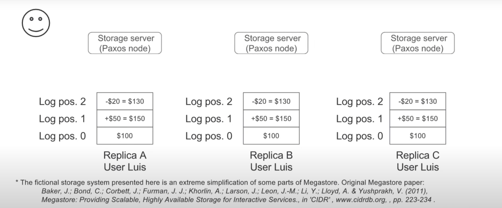
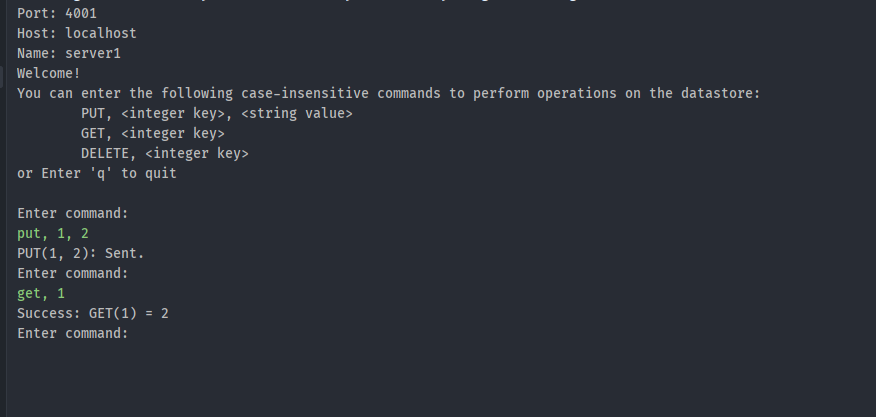
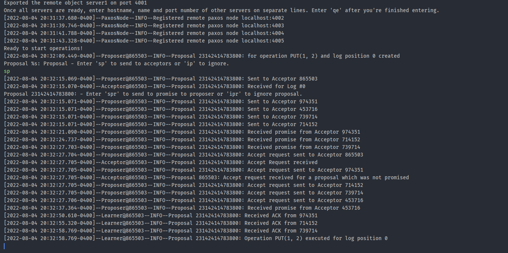
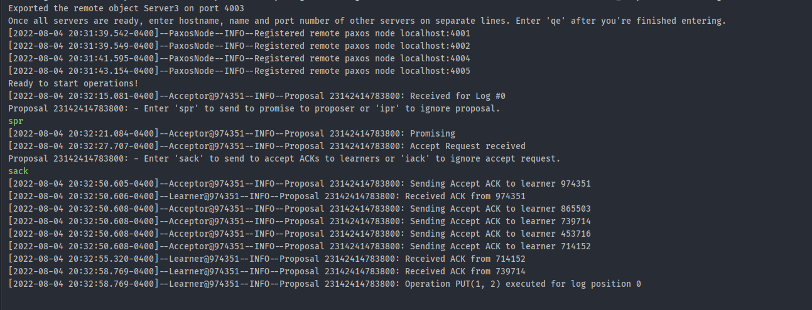

# Key-Value Store using PAXOS

## Overview

The project features a Key-Value data store that takes in an integer as a key and a string as value.
This data store can be manipulated and queried by a remote client by remotely invoking methods on
the objects bound to the registry by our server. To support RPC, the server and client use Java's
RMI. Currently, the server supports 3 operations on the data store:

- `PUT, <key>, <value>` - Creates a new entry in the datastore for the key, or updates the current
  one with the new value if `key` already exists.
- `GET, <key>` - Returns the value of the key if such a key exists in the datastore.
- `DELETE, <key>` - Deletes the entry pertaining to the `key` if such a key exists in the datastore.

The application supports creating any number of servers and provides the client the ability to connect to any of them.
The client may choose to call methods like PUT, DELETE on the server they're connected to, however, the application
internally uses PAXOS algorithm to manage distributed database.

The purpose of this project was to bolster one's understanding of how RPC and PAXOS works, as well as develop
a system that is resistant against failures. I believe this purpose has been fulfilled. While
developing this project, I quickly realized that there are many minute details that need to be taken
into consideration before we can come up with a concrete solution. Developing this project has
provided me a short introduction to what developing intricate backends for production apps may look
like.

## Technical Impressions

The project is developed using Java and Java's RMI. After researching about both, RMI and Apache
Thrift, I realised that while Apache Thrift provides much greater flexibility, this project doesn't
require the granular control offered by Thrift. Therefore, I decided to use RMI which is included in
the JDK.

### PAXOS

#### The Consensus

- Since we are dealing with distributed databases and not a single value, it is not possible to run PAXOS for some
  database value.
- Instead, we can imagine database to be a set of operations performed sequentially that resulted in it's current state.
- In my implementation, the 'sequence' of these operations is maintained by a "Log".
- Each entry in this log corresponds to an operation performed on the datastore in a way that if the same operations
  were performed in the same sequence, we would end up with an exact replica of the database.
- Therefore, it is important that this _sequence_ is maintained.
- Hence, our PAXOS run is concentrated upon creating consensus on what operation should be performed at a particular log
  position rather than just being concerned about what operation is to be performed.
- Our log starts from position 0. Each proposer proposes an operation for a log position. If this proposal is accepted,
  it increments the log counter by 1, and so on.


Log based consensus (src: [Google](https://www.youtube.com/watch?v=d7nAGI_NZPk&t=1s))

#### Proposer

- According to my implementation, a `Proposer` is an entity that communicates with the client and generates proposal for
  consensus per requirement.
- `Proposer` itself consists of two parts: `ServerProposer` and `ClientProposer`.
- The `ClientProposer` is the remote object that is available with the client. The interface exposes key features that
  our datastore has to offer, like put, delete and get.
- `ServerProposer` exposes the proposer's abilities to receive promises and act upon them.
- When the client requests for any action that modifies the datastore, like PUT or DELETE, it does so through
  the `ClientProposer`.
- The `ClientProposer` then requests the `ServerProposer` to prepare a proposal to execute the operation and send it to
  all acceptors.
- For requests that only perform read operations on the datastore, the `ServerProposer` directly communicates with the
  learner to query the required key.
- One the proposer receives a majority of promises from the acceptors, it readies itself to send accept requests to all
  the proposers.
- If a value is piggybacked along with the promise, the proposer asks all acceptors to accept the piggybacked value,
  else it proposes the operation that the user had requested.
- A proposal contains a unique, incrementing proposalID. This ID is generated using UTC timestamps with nanosecond level
  precision. Therefore, any proposal created after some other proposal will always have a higher proposal ID.

#### Acceptor

- An `Acceptor` decides whether to accept a proposer's proposal.
- An `Acceptor` gets activated when it receives a proposal from a proposer.
- If the proposal has the highest proposal ID that the acceptor has seen for the log position, it takes a note of this
  proposal and sends back a promise to the proposer. If it is not the highest proposalID that it has seen, the acceptor
  does not respond to the sender at all.
- It also checks if a proposal for the same log position has been accepted, and if that is the case, it attaches the
  accepted value with the promise.
- Then, upon receipt of an `AcceptRequest` from the proposer, it again checks if the particular proposalID is still the
  highest one it has seen. If yes, then it takes note of the accepted proposal and sends an acknowledgement to learners
  regarding the same.
- The acceptor internally maintains a Map of proposal received for a log position. It keeps substituting the proposal
  for a log position if required.
- The acceptor also maintains a list of proposal that were accepted by itself, i.e. a list of proposals for which ACKs
  were sent out to learners.

#### Learner

- The `Learner` learns about the acceptance of some operations through acceptors and executes the operation on the
  datastore.
- After it receives majority acknowledgements from acceptors for a log position, it executes the operation upon the
  datastore.
- For this, it internally maintains a ConcurrentHashMap that keeps track of a list of ACKs received for a particular log
  position.
- It then calls the `Operation`'s `execute` method and subsequently saves the executed operation in a map of executed
  operations so that same operation can't be performed twice.

#### PaxosNode

- Each node in our system is an acceptor, proposer, as well as a learner.
- These roles are encapsulated by the interface `PaxosNode`.
- Apart from supporting above-mentioned features, it also supports adding other remote nodes to a list of nodes that
  each node maintains so that nodes can communicate with each other.

## Running the Program

_NOTE_: If you open this project as an intelliJ project, you can use the run configurations "5 Servers" and "5 Clients".
It will boot up 5 Servers from ports 4001-4005 and boot up 5 clients each connected to a respective server.

### Running the Server

- The server can be executed by running `server.driver.ServerDriver` or corresponding JAR file.
- `ServerDriver` takes 3 arguments (in any order):
    - `-p <port>`: Port at which the server will start it's registry.
    - `-n <name>`: Name of the server's remote object.
    - `-f <filepat>`: (optional) path to configuration file for the server.
- e.g. `java ServerDriver -p 4001 -n server1 -f res/start1.txt`
- `ServerDriver` will create one remote server object.

#### Steps to initialize multiple servers

- First, boot up _n_ instances of ServerDriver with required CLI arguments.
- You will notice that each server asks for the information regarding remote objects of other servers. _Do not give any
  client requests at this stage_.
- This step is required to let the servers know about the existence of other servers so that they can communicate with
  each other.
- Follow the instructions and enter `hostname, remoteName, port` for every other server on a new line.
- Once you're done adding server information, enter "qe".
- Repeat the same process for all server replicas.
- You can now begin sending client requests.

e.g.


You can avoid writing all this information in the console by creating a configuration file in the format
of `res/start1/txt`, and then pass the filepath as a command line argument the program as mentioned above.

### Running Client

- The client can be executed by running `client.driver.RmiClientDriver` or corresponding JAR file.
- The client's driver accepts 3 command line arguments:
    1. `-p <port number>`: the port number at which the server registry is to be found. The port number must be a number
       in the
       range [1024, 65535].
    2. `-h <host name>`: name of the host for server
    3. `-n <name>`: name to which the remote `ServerRemote` is bound to.
- E.g:

```shell
java RmiClientDriver -n Server1 -p 4001 -h localhost
```

### Using the program

Following is the list of valid commands. All the commands are case-insensitive. Each parameter in
the command is seperated by a ",".

1. `PUT, <key>, <value>`, e.g. `put, 3, there`
2. `GET, <key>`, e.g. `get, 3`
3. `DELETE, <key>` e.g. `delete, 3`

Here, the keys must be valid integers. The values are strings.

If the command is invalid, the controller will try to respond with an error message as specific as
possible to let the user know what part of the command is malformed, else it will respond with a
message denoting successful execution of the command.

After booting up the client, the client will prompt the user for inputs and print out the responses
to the standard output.

The server pre-populates the `DataStore` with the following key-value pairs:

1. 1 -> one
2. 2 -> two
3. 3 -> three
4. 4 -> four
5. 5 -> five

- After you enter a command on the client side, you will see input prompts on the server side.
- These prompts stop the execution of the PAXOS algorithm at strategic points and allows users to experiment with
  different sequence of input proposals.
- If you chose to ignore a proposal, you will be able to re-enact a scenario where the acceptor failed to receive a
  proposal from the proposer and so on.
- You can just wait for a while before accepting the prompt to simulate communication delays.
- Sometimes the logs may get in the way and you might not notice the input prompt at all, so please be aware.

### Example run

- The following example shows a client trying to PUT a key in a 5 server environment while being connected to server 1.


The client first sends the PUT command and then GETs the key to verify the execution of operation.


The contacted server receives the requests, creates a proposal, asks the user to send the proposal, receives promises
and then
sends ACKs as it got the majority.


A replica server's acceptor receives the proposal, asks the user to accept it, sends back promise, receives an accept
request, then sends ack to learners, and as soon as the learner receives majority, it executes the operation.

To run the .jar files, navigate to /res.

## Example Commands

Following are some valid example commands that you can try:

- `put, 2, two`
- `put, 5, five`
- `delete, 2`
- `get, 5`
- `delete, 5`

## Assumptions

- That the remote registry works as expected. The remote objects are non-perishable.

## Limitations

- To simulate fail scenarios, it uses user input and therefore bulk operations cannot be performed at speed.

## Citations

- https://docs.oracle.com/en/java/
